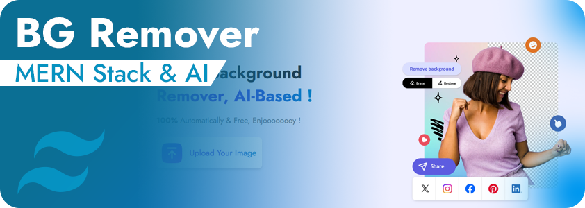
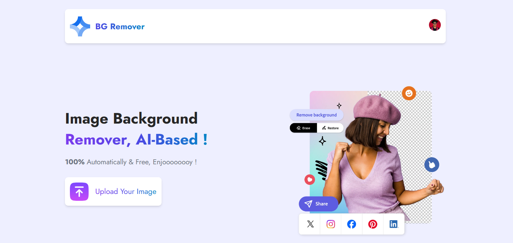
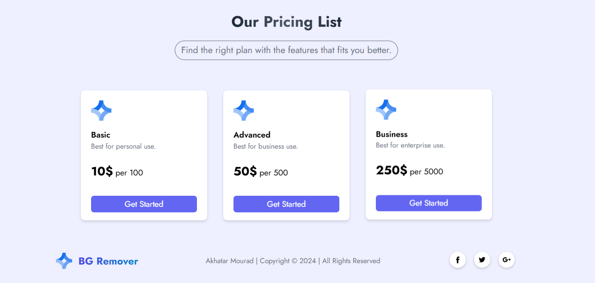
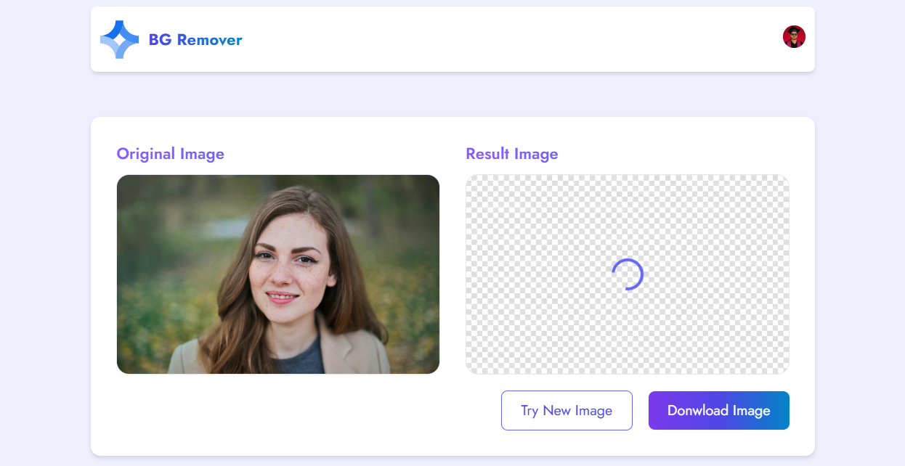

# Image Background AI Remover



## Overview

BG Removr is a modern web application for removing image backgrounds, built using the MERN Stack (MongoDB, Express.js, React.js, Node.js) with integrated AI-based background removal. The project features a responsive design and offers a user-friendly experience with a sleek UI.


## Details

- **Home Page :** Directly upload and preview images, Learn more about the technology and the service.
- **Pricing Page :** Get detailed pricing information based on usage and subscription options.
- **Remover Page :** View the results of the background removal and download the processed images.

## Demo | Screenshots

Seamlessly manage user authentication with a clean and simple registration and login interface.


Upload images instantly with a user-friendly drag-and-drop interface and explore the service.



Clear and transparent pricing options tailored to your needs, with flexible subscription plans.



Preview and download your images with backgrounds removed using cutting-edge AI technology.



## Usage

First, clone the project using the repositroy URL, then move to the Project folder then use the [npm](https://www.npmjs.com/) to install necessary packages & dependencies for each side ( Client Side & Server Side).

```bash
npm install
```

Run the application using the following command (for frontend):

```bash
npm run dev
```

then, the run the backend service using the following command : 

```bash
npm start
```

After running the application, you can access the dashboard via the link provided in the client side console.

## 🔗 Links

[](https://akhatarmourad.github.io/portfolio/)
[](https://www.linkedin.com/in/akhatarmourad/)